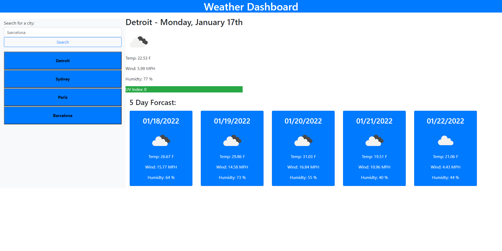

<h1>Challenge 56: Weather Dashboard <h2>
 
 <h2>Site URL:</h2>
  https://nickus1028.github.io/Weather-Dashboard/
 
 <h2>Screenshot<h2>
 </img>
   
 <h2>Summary</h2>
   
  <ul>
    <li>Using third party APIs (JQuery, JQuery UI, Moment.js and Bootstrap) created a Weather Dashboard</li>
    <li>Used Open Weather Map API to query data</li>
    <li>Dynamically created HTML elements to display current forcast</li>
    <li>Dynamically created HTML elements to display a 5-day forcast</li>
    <li>Pushed searched cities to local storage</li>
    <li>Pulled data from local storage and displayed search history</li>
   </ul>

